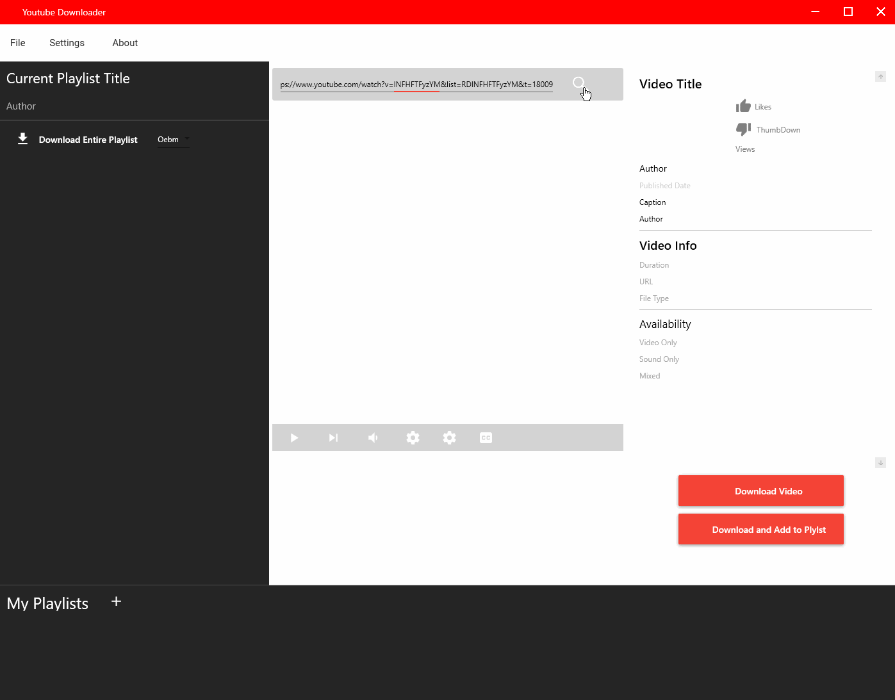

## Youtube Downloader
A vanity project using the Youtube Explode Library

<b>Built with</b>
- Youtube Explode
- .NET Core
- WPF

## Features
 - Can currently download Youtube videos in Webm format, using the videos url
 - Can also list the corresponding playlist of the currently selected list if it exists
 - Conversion from Webm to mp4 is currently incomplete, but works in testing

## An example of basic functionality

## License
MIT

